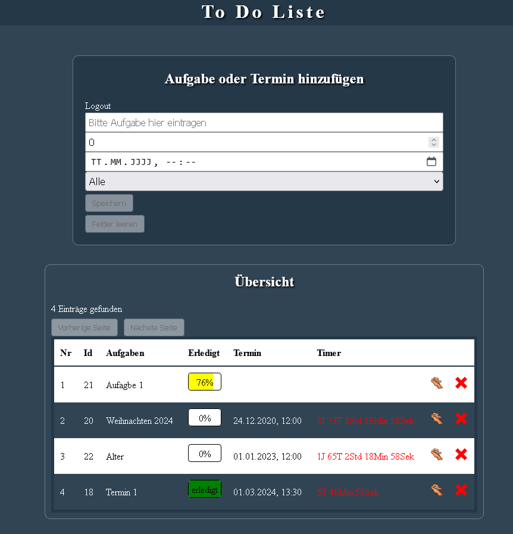

ToDoList

PHP:
1. toDoData.php in das XAMPP htdocs Verzeichnis kopieren
Apache und SQL Server in XAMPP starten

SQL:
phpmyadmin aufrufen: http://localhost/phpmyadmin/
Datenbank "todo.sql" aus dem Ordner _sql im phpmyadmin importieren

REACT:
1. npm install
2. npm run dev

Login: 
Mail: admin@admin.de
Passwort: admin

